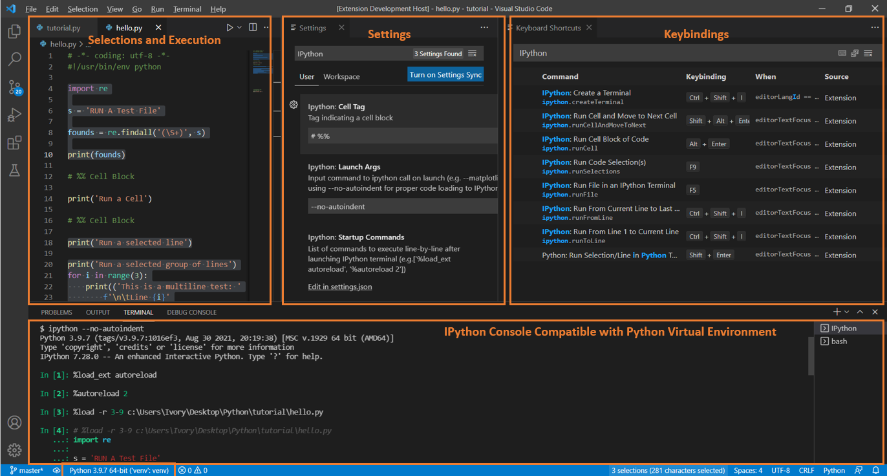

# ipython

Enable IPython Terminal creation and direct execution of `python` code from
editor.

If you find the extension useful, it would be awesome if you can leave a comment
 here and/or a suggestion on GitHub!!
- What feature you like and use the most?
- What other feature(s) you would like to have?

## Features

Key features tagged with `IPython`:
- Configurations to control the startup of an IPython console
    - Launch argument (e.g., `--matplotlib=qt5`)
    - Start up command (e.g., `["%load_ext autoreload", %autoreload 2]`)
- Configurable:
    - Cell block tag (e.g., `# %%`)
    - `%run` arguments (e.g., `-t` print timing info)
    - Command line arguments (i.e., `sys.argv` parameters)
- Useful command to run `python` code interactively
    - E.g., run a file, selection(s) of code, cell block, run to line, run from line, ...

See `ipython: Feature Contribution` tab in VSCode Extension (Ctrl + Shift + X)
panel for latest features and details.

## Requirements

[Microsoft Python Extension](https://marketplace.visualstudio.com/items?itemName=ms-python.python)

**Strongly recommend setting `Git Bash` as default terminal on Window to properly launch an IPython terminal.**

## Release Notes

### 2022.9.x
- Fixed a bug with `runSelection` executing line-by-line on Linux instead of as a block (issue #17)
- Always save file in `runFile` command so that `%run` magic works as intended
    - Other `run` commands (e.g., `selection`, `toLine`, `fromLine`) respect user choice
- Added `Move Cursor to Cell Tag Above/Below`
- Added `Run Arguments` and `Command Line Arguments` for `Run File` variants
    - Default `F5` to `Run File with Command Line Arguments`
        - If `Command Line Arguments` is empty, then it reduces to regular `Run File`
    - Added `Shift+F5` to `Run File with Run and Command Line Arguments`
        - Defaulted `Run Arguments` to `-t` which prints `%run` timing
- Fixed a bug with `Run Cell` skipping last cell line
- Configuration applies immediately when changed instead of only when extension
activated

### 2022.7.x
- Changed handling of code block from `%load` to directly sending it to terminal.
  - **NOTE**: sending large text block to IPython sometime causes it to reder
  incorrectly. If needed, use `up-arrow-key` to see actual code executed.
    - Restarting, creating a new IPython terminal, or resize it to be more
    vertical usually fixes the rendering issue.
- Added run line at cursor
  - If runSelections is called and no text selected, then run the line the
  cursor is on.
  - This applies independently for each cursor (e.g., `Alt+Click` adds more cursors)
- More details in [issue `#11` note](https://github.com/hoangKnLai/vscode-ipython/issues/11#issuecomment-1186551199)
### 2022.4.x
- Changed `execute()` of `python` code ensuring an `ExecLagMilliSec` between
every major `enterKey` pressed to `IPython` terminal.
  - User should adjust `ExecLagMilliSec` fitting their computer performance
- Added `ExecLagMilliSec` configuration to help with sendText race condition
- Added `reset and run` command

### 2021.10.17
- Added an 100ms between every command execution to alleviate sendText
race condition

### 2021.10.15

**Fixes:**
- ipython.createTerminal startup commands and launch commands race condition

### 2021.10.3

**Fixes:**
- ipython.createTerminal not executing startup commands correctly

### 2021.10.3

**Features**:
- Handling of encoding `# -*- coding: <encoding-name> -*-` automatically when
parsing code to send to IPython console
- Added ipython.runToLine and ipython.runFromLine

**Fixes:**
- Keybindings
- Default settings
- Various small bugs

### 2021.09.1

**Features**:
- Added keybinds (overwrite base interactive python and Jupyter)
  - Recommend rebind as needed
- Added run cell and go to next (`ipython.runCellAndMoveToNext`)
- Added customizable cell block tag option
- Other minor QoL

**Fixes:**
- Fixed versioning number
- Default settings
- Various small bugs

### 2021.09.0
Hot of the press!

