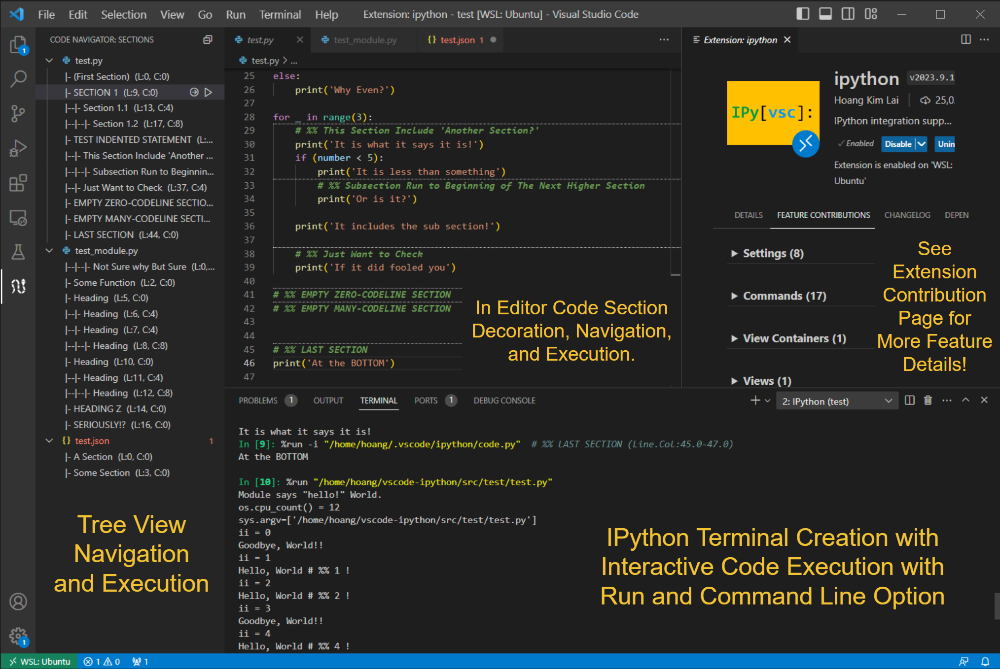

# ipython

Enable IPython Terminal creation and direct execution of `python` code from
editor.

If you find the extension useful, it would be awesome if you can leave a comment and/or a suggestion on GitHub!!

- What feature you like and use the most?
- What other feature(s) you would like to have?

## Features

Key features tagged with `IPython`:

- Creation and handling of IPython terminals
  - Launch argument (e.g., `--matplotlib=qt`)
  - Start up command (e.g., `["%load_ext autoreload", %autoreload 2]`)
  - Dedicated terminal linked to a file (`ctrl+shift+i f5`) (issue #33). When linked,
    - The terminal has the `file.py` name
    - Running the `file.py` with `f5` always run it in the dedicated terminal
- Run `python` code interactively on IPython terminal
  - E.g., run a file, selection(s) of code, code section, run to line, run from line, ...
- Settings for code custom sectioning and execution
  - Support multiple code section tags (e.g., `# %%`, `// ==`, or regular expression)
  - Code section tag assocation option to a list of file extensions (e.g., `.py, .ts, .md`)
  - `%run` arguments (e.g., `-t` print timing info when running a `script.py`)
  - Command line argument equivalent to `sys.argv` of `python foo.py argv`
- Editor visualization of code section blocks (issue #25)
  - Horizontal line divider and bolder text indicating each section starting line
- Code section navigation and execution (issue #30)
  - A view in the primary sidebar providing section heading layout of associated files
  - Use `cltr+shift+i b` to open `Code Section Navigator`
  - Click on a heading focus the active editor to the section
  - Various execution buttons are provided for file and section code execution

See `ipython: Feature Contribution` tab in VSCode Extension (Ctrl + Shift + X)
panel for latest features and details.

## Requirements

`python.exe` with `ipython` package installed (recommend using virtual
 environment such as `virtualenv`). Here are some info:

- Install `python` from [python.org](https://www.python.org/downloads/)
- Create a virtual environment. See [guides](https://packaging.python.org/en/latest/guides/installing-using-pip-and-virtual-environments/).
- Activate your virtual environment
- Install `ipython`. See [ipython.org install guide](https://ipython.org/install.html).
- Should be good to go when your VSCode terminal with the activated virtual environment can execute `ipython --version` to check for the IPython version number

[Microsoft Python Extension](https://marketplace.visualstudio.com/items?itemName=ms-python.python)

- This should automatically installed with when this extension is installed

**Strongly recommend setting `Git Bash` as default terminal on Window to properly launch an IPython terminal.**

## Release Notes

### 2023.10.x

- Enhanced IPython terminal handling
  - Allow user to custom name the terminal as needed
  - Added dedicated terminal feature (issue #33)
  - Fixed a bug with `IPython` tag in terminal name sometime fails to change
  causing failure in identifying `IPython` enabled terminal
- Other general fixes and minor changes

### 2023.9.x

- Added new commands and keybinds
  - `runToSection (ctrl+shift+i k)` run code from top of file to end of section
  at cursor
  - `runFromSection (ctrl+shift shift+k)` run code from start of section at
  cursor to end file

- Improved section navigator
  - General formatting of section label to be less noisy
  - Added button for `runToSection(), runFromSection()`

- Added tree view for file section (indicated by a set of `sectionTag` such as `# %%`)
  - `jumpToSection`: jump to section in text editor and focus on it
    - Support any text files with `sectionTag`
  - `runFile, runSection`: excution interaction on tree view
    - Support a configurable set of file extensions such as `.py, .ts, .md`

- Refactored cell of code to section of code for clarity
- Refactored run options:
  - Removed `reset` and then `run` options since `%run` does this by default
  - Run section is defaulted to use `.vscode/ipython/code.py` with
    identification
    - E.g., `%run -i ".vscode/ipython/code.py"  # Section A (Line 1:10)`
  - Added option to use `code.py` to run code sections with `%run -i` or `%load`
    - Recommend `%run -i` for speed and clarity
    - NOTE: likely to deprecated usage of `%load` in a future release

- Removed usage of `clipboard` option for sending code to terminal
  - It was hacky and intrusive

### 2023.8.x

- Added section dividers
- Added an alpha feature `runLineAndAdvance` (#18)
- Defaulting send code to `file` instead of `clipboard`

### 2023.3.x

- Fixed a minor bug with sending multi-line code on Linux

### 2023.2.x

- Added a `SendCommandMethod` setting with `file` or `clipboard` options
  - `file`: uses `.vscode/ipython/command.py` and `%load command.py` to terminal
  - `clipboard`: prior method of copy-paste via system clipboard
- Fixed a bug with calling `ipython` with an empty  `--InteractiveShellApp.exec_lines=''`. See issue #21.

### 2022.9.x

- Fixed a bug with `runSelection` executing line-by-line on Linux instead of as a block (issue #17)
- Always save file in `runFile` command so that `%run` magic works as intended
  - Other `run` commands (e.g., `selection`, `toLine`, `fromLine`) respect user choice
- Added `Move Cursor to Section Tag Above/Below`
- Added `Run Arguments` and `Command Line Arguments` for `Run File` variants
  - Default `F5` to `Run File with Command Line Arguments`
    - If `Command Line Arguments` is empty, then it reduces to regular `Run File`
  - Added `Shift+F5` to `Run File with Run and Command Line Arguments`
    - Defaulted `Run Arguments` to `-t` which prints `%run` timing
- Fixed a bug with `Run Section` skipping last section line
- Configuration applies immediately when changed instead of only when extension
activated

### 2022.7.x

- Changed handling of code block from `%load` to directly sending it to terminal.
  - **NOTE**: sending large text block to IPython sometime causes it to reder
  incorrectly. If needed, use `up-arrow-key` to see actual code executed.
    - Restarting, creating a new IPython terminal, or resize it to be more
    vertical usually fixes the rendering issue.
- Added run line at cursor
  - If runSelections is called and no text selected, then run the line the
  cursor is on.
  - This applies independently for each cursor (e.g., `Alt+Click` adds more cursors)
- More details in [issue `#11` note](https://github.com/hoangKnLai/vscode-ipython/issues/11#issuecomment-1186551199)

### 2022.4.x

- Changed `execute()` of `python` code ensuring an `ExecLagMilliSec` between
every major `enterKey` pressed to `IPython` terminal.
  - User should adjust `ExecLagMilliSec` fitting their computer performance
- Added `ExecLagMilliSec` configuration to help with sendText race condition
- Added `reset and run` command

### 2021.10.17

- Added an 100ms between every command execution to alleviate sendText
race condition

### 2021.10.15

**Fixes:**

- ipython.createTerminal startup commands and launch commands race condition

### 2021.10.3

**Fixes:**

- ipython.createTerminal not executing startup commands correctly

**Features**:

- Handling of encoding `# -*- coding: <encoding-name> -*-` automatically when
parsing code to send to IPython console
- Added ipython.runToLine and ipython.runFromLine

**Fixes:**

- Keybindings
- Default settings
- Various small bugs

### 2021.09.1

**Features**:

- Added keybinds (overwrite base interactive python and Jupyter)
  - Recommend rebind as needed
- Added run section and go to next (`ipython.runSectionAndMoveToNext`)
- Added customizable section block tag option
- Other minor QoL

**Fixes:**

- Fixed versioning number
- Default settings
- Various small bugs

### 2021.09.0

Hot of the press!
